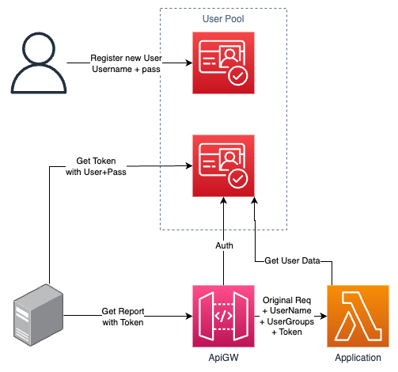

# sample-api-gateway-cognito-lambda-auth
A Cloudformation template to example an API-Gateway+Lambda authenticated with Cognito User-Pool. 



### How to deploy
* AWS CLI Cloudformation
  * https://docs.aws.amazon.com/cli/latest/reference/cloudformation/deploy/
* SAM CLI
  * https://docs.aws.amazon.com/serverless-application-model/latest/developerguide/sam-cli-command-reference-sam-init.html
  * https://docs.aws.amazon.com/serverless-application-model/latest/developerguide/sam-cli-command-reference-sam-deploy.html

### Deploy outputs
* SignupURL:
  * UI to signup new users
* AppClientId:
  * Cognito App Client ID 
* GetTokenURL:
  * API endpoint to generate Access Token
* SampleApiURL
  * Example of API Endpoint to test auth

### How to use:
1. Deploy using one of the options above
2. Sign up new user
3. Navigate to user-pool console, and confirm the user
4. Navigate to user-pool console, and custom account-id to the newly created user
   * optional - instead of account-id, groups can be used.
5. Generate Access Token using the `Get Access Token` CURL Example
6. Call Sample API using the `Access Token` and the `Sample API` CURL Example

### Before production usage
1. Signup + Confirmation can be automated using scripting over lambda (after signup)
2. JWT Access token contains the Username and any group assigned to it. This is public info so use with care
3. `Get Access Token` endpoint better be wrapped with own service. mainly in order to keep the Cognito's `ClientId` secured.

### CURLs Examples:
#### Get Access Token
Values to replace:
* `<GetTokenURL>`
* `<USERNAME>`
* `<PASSWORD>`
* `<AppClientId>`
```
curl --location '<GetTokenURL>' \
--header 'X-Amz-Target: AWSCognitoIdentityProviderService.InitiateAuth' \
--header 'Content-Type: application/x-amz-json-1.1' \
--data-raw '{
    "AuthFlow": "USER_PASSWORD_AUTH",
    "AuthParameters": {
        "USERNAME": "<USERNAME>",
        "PASSWORD": "<PASSWORD>"
    },
    "ClientId": "<AppClientId>"
}'
```
#### Get Access Token
Values to replace:
* `<AccessToken>`
* `<SampleApiURL>`
```
curl --location '<SampleApiURL>' \
--header 'Authentication: <AccessToken>'
```